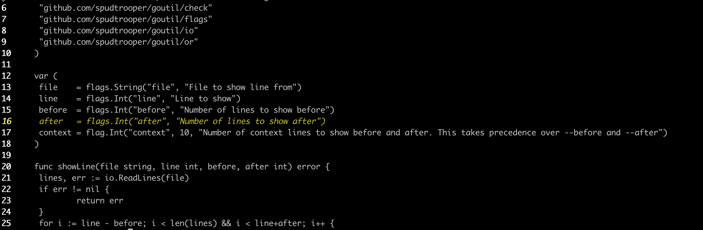

# showlines

Command line tool to show a given line in a file with some context.

## Example

```bash
showlines --file main.go --line 16
```



## Install

```bash
go install github.com/spudtrooper/showlines
```